# 3주차

## Vision AI의 이해

---

# AI Category

<hr/>

###### | <span style="background:rgb(255, 255, 164)">🏷️ 자연어 처리 (NLP, Natural Language Processing)</span>

- 🎇 챗봇, 번역기, 음성 인식, 텍스트 요약, 감정 분석

- 대표 모델: `GPT`, `BERT`, `T5`

###### | <span style="background:rgb(255, 255, 164)">🏷️ 컴퓨터 비전 (CV, Computer Vision)</span>

- 🎇 이미지 분류, 객체 탐지, 얼굴 인식, 자율 주행, 의료 영상 분석

- 대표 모델: `CNN`, `YOLO`, `ViT (Vision Transformer)`

---

# AI Category

<hr/>

###### | 추천 시스템 (Recommendation Systems)

- 🎇 유튜브, 넷플릭스, 쇼핑몰 추천 엔진

- 주요 사용 툴: `협업 필터링(CF)`, `강화 학습 기반 추천`, `딥러닝 기반 추천`

###### | 로보틱스 및 제어 (Robotics & Control AI)

- 🎇 로봇 팔 제어, 자율 주행, 드론 비행 경로 최적화

- 대표 기술: `강화 학습(RL)`, `A-star`

---

# AI Category

<hr/>

###### | 생성형 AI (Generative AI)

- 🎇 이미지 생성(DALL·E), 음악 작곡, 코드 생성

- 대표 모델: `GAN`, `Diffusion`, `Transformer`

###### | 시뮬레이션 및 게임 AI

- 🎇 게임 NPC AI, 체스·바둑 AI(알파고)

- 대표 기술: 몬테카를로 트리 탐색(MCTS), 강화 학습(RL)

---

# AI Category

<hr/>

###### | 금융 및 데이터 분석 AI

- 🎇 주가 예측, 사기 탐지, 신용 점수 평가

- 대표 기술: 시계열 분석(RNN, LSTM), 앙상블 학습(Random Forest, XGBoost)

---

<style scoped>{text-align: center;}</style>

# 자연어 처리

<div style="height:40px"></div>

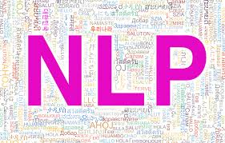

---

# NLP Category - <span style="font-size: 20px; color: #5f7c8a">주요 목적</span>

###### <span style="color: #5f7c8a">1. 텍스트 분석 및 이해</span>

<hr/>

##### 📌 문서 분류 (Text Classification)

- 이메일 스팸 필터링, 뉴스 카테고리 분류, 감정 분석

- 대표 모델: `Naive Bayes`, `BERT`, `RoBERTa`

##### 📌 문서 요약 (Text Summarization)

- 긴 문서를 요약해 핵심 내용만 추출, 추출적 요약(Extractive) vs 생성적 요약(Abstractive)

- 대표 모델: `BART`, `T5`, `Pegasus`

---

# NLP Category - <span style="font-size: 20px; color: #5f7c8a">주요 목적</span>

###### <span style="color: #5f7c8a">1. 텍스트 분석 및 이해</span>

<hr/>

##### 📌 감정 분석 (Sentiment Analysis)

- 텍스트에서 감정을 분석 (긍정, 부정, 중립), 제품 리뷰 분석, 소셜미디어 의견 분석

- 대표 모델: `LSTM`, `BERT`

##### 📌 토픽 모델링 (Topic Modeling)

- 문서에서 주요 주제(Topic)를 자동으로 추출

- 대표 기법: `LDA(Latent Dirichlet Allocation)`, `BERT Topic`

---

# NLP Category - <span style="font-size: 20px; color: #5f7c8a">주요 목적</span>

###### <span style="color: #5f7c8a">2. 언어 생성 및 변환</span>

<hr/>

##### 📌 기계 번역 (Machine Translation, MT)

- 자동 번역 시스템 (ex: Google Translate)

- 대표 모델: `Transformer`, `MarianMT`, `NLLB`

##### 📌 문장 생성 (Text Generation)

- 새로운 문장을 생성하는 AI(ex. `GPT`, `ChatGPT`, `Claude`, `Gemini`)

- 용도: 대화형 AI, 창작 AI, 소설 자동 생성

---

# NLP Category - <span style="font-size: 20px; color: #5f7c8a">주요 목적</span>

###### <span style="color: #5f7c8a">2. 언어 생성 및 변환</span>

<hr/>

##### 📌 자연어 질의응답 (Question Answering, QA)

- 질문을 입력하면 정답을 반환하는 AI

- 대표 모델: `BERT-QA`, `GPT-4`

---

# NLP Category - <span style="font-size: 20px; color: #5f7c8a">주요 목적</span>

###### <span style="color: #5f7c8a">3. 텍스트 구조 분석</span>

<hr/>

##### 📌 품사 태깅 (POS Tagging)

- 문장에서 각 단어의 품사(명사, 동사 등) 태깅

- **주요 사용 예시**: 한국어 형태소 분석기 (`KoNLPy`, `Mecab`)

##### 📌 구문 분석 (Syntax Parsing)

- 문장의 구조의 트리 형태 분석, 토큰화화

- **주요 사용 예시**: `"나는 밥을 먹었다."` → `'나는'(주어)` `'밥을'(목적어)` `'먹었다'(동사)`

---

# NLP Category - <span style="font-size: 20px; color: #5f7c8a">주요 목적</span>

###### <span style="color: #5f7c8a">3. 텍스트 구조 분석</span>

<hr/>

##### 📌 의미 분석 (Semantic Analysis)

- 단어의 의미와 문맥을 고려한 이해

- **주요 사용 예시**: `Word2Vec`, `GloVe`, `컨텍스트 분석(BERT)`

---

# NLP Category - <span style="font-size: 20px; color: #5f7c8a">주요 목적</span>

###### <span style="color: #5f7c8a">4. 음성 및 대화 시스템</span>

<hr/>

##### 📌 음성 인식 (Speech-to-Text, STT)

음성 to 텍스트 변환 → Siri, Google Assistant, AI 콜봇

- 대표 모델: `Whisper`, `DeepSpeech`

##### 📌 텍스트 음성 변환 (Text-to-Speech, TTS)

텍스트 to 음성 변환 → 네이버 Clova, 구글 TTS

- 대표 모델: `Tacotron`, `VITS`, `FastSpeech`

---

# NLP Category - <span style="font-size: 20px; color: #5f7c8a">주요 목적</span>

###### <span style="color: #5f7c8a">4. 음성 및 대화 시스템</span>

<hr/>

##### 📌 대화형 AI (Conversational AI)

대화형 AI 챗봇 → ChatGPT, Claude, Bing Chat

- 대표 모델: `GPT`, `LaMDA`, `Gemini`

---

# NLP Category - <span style="font-size: 20px; color: #5f7c8a">주요 목적</span>

###### <span style="color: #5f7c8a">5. 정보 검색 및 추천</span>

<hr/>

##### 📌 정보 검색 (Information Retrieval, IR)

- 대량의 문서에서 적절한 정보 검색 :: 구글 검색, 기업 내부 문서 검색 시스템

- 대표 모델: `BM25`, `Dense Retriever (DPR)`

##### 📌 문서 유사도 분석 (Text Similarity)

- 두 문서의 유사성 계산 :: 논문 표절 검사, 유사 뉴스 기사 탐색

- 대표 기법: `Cosine Similarity`, `BERT Embeddings`

---

# NLP Category - <span style="font-size: 20px; color: #5f7c8a">주요 목적</span>

###### <span style="color: #5f7c8a">5. 정보 검색 및 추천</span>

<hr/>

##### 📌 개체명 인식 (Named Entity Recognition, NER)

- 문장에서 유혀 정보 추출

- ex. "이순신 장군은 1545년에 태어났다." → `이순신: 인물`, `1545년: 날짜`

##### 📌 관계 추출 (Relation Extraction)

- 개체 간 관계를 파악

- ex. "스티브 잡스는 애플을 창립했다." → `스티브 잡스`, `창립자`, `애플`

---

<style scoped>{text-align: center;}</style>

# 컴퓨터 비전

<div style="height:40px"></div>


---

# 컴퓨터 비전- <span style="font-size: 20px; color: #5f7c8a">주요 목적</span>

###### <span style="color: #5f7c8a">1. 이미지 인식 및 분석</span>

<hr/>

##### 📌 Image Classification (이미지 분류)

- 전체 이미지를 하나의 카테고리로 분류 (ex. 개 vs 고양이 분류)

- 대표 모델: `CNN`, `ResNet`, `EfficientNet`, `ViT`

##### 📌 Object Detection (객체 탐지)

- 이미지에서 여러 객체의 위치와 종류 탐지 (ex. 교통카메라에서 차량과 보행자 인식)

- 대표 모델: `YOLO`, `Faster` `R-CNN`, `DETR`

---

# 컴퓨터 비전- <span style="font-size: 20px; color: #5f7c8a">주요 목적</span>

###### <span style="color: #5f7c8a">1. 이미지 인식 및 분석</span>

<hr/>

<!-- 중앙정렬 -->
<style scoped>
   table{width: 100%}
   td {text-align: center;}
</style>

| Classification                  | Object Detection                 |
| ------------------------------- | -------------------------------- |
| 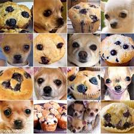 |  |

---

# 컴퓨터 비전- <span style="font-size: 20px; color: #5f7c8a">주요 목적</span>

###### <span style="color: #5f7c8a">1. 이미지 인식 및 분석</span>

<hr/>

##### 📌 Image Segmentation (이미지 세분화)

- 이미지의 모든 픽셀에 대한 카테고리로 분류

- **Semantic Segmentation**: 같은 클래스(예: 모든 자동차)를 동일하게 분류

- **Instance Segmentation**: 개별 객체(예: 서로 다른 자동차)를 구별

- 대표 모델: `DeepLab`, `Mask R-CNN`, `Segment Anything Model (SAM)`

---

# 컴퓨터 비전- <span style="font-size: 20px; color: #5f7c8a">주요 목적</span>

###### <span style="color: #5f7c8a">1. 이미지 인식 및 분석</span>

<hr/>

<!-- 중앙정렬 -->
<style scoped>
   table{width: 100%}
   td {text-align: center;}
</style>

| Semantic Segmentation            | Instance Segmentation            |
| -------------------------------- | -------------------------------- |
| 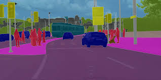 | 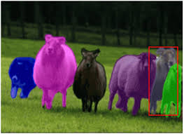 |

---

# 컴퓨터 비전- <span style="font-size: 20px; color: #5f7c8a">주요 목적</span>

###### <span style="color: #5f7c8a">2. 이미지 생성 및 변형</span>

<hr/>

##### 📌 Image Generation (이미지 생성)

- 이미지를 생성하는 AI

- 예: `DALL·E`, `Stable Diffusion`, `Midjourney`, `NovelAI`

##### 📌 Image Super-Resolution (초해상도 복원)

- 저화질 이미지를 고화질로 변환(ex. 4K 업스케일링, 오래된 사진 복원)

- 대표 모델: `ESRGAN`, `S'winIR`

---

# 컴퓨터 비전- <span style="font-size: 20px; color: #5f7c8a">주요 목적</span>

###### <span style="color: #5f7c8a">2. 이미지 생성 및 변형</span>

<hr/>

<!-- 중앙정렬 -->
<style scoped>
   table{width: 100%}
   td {text-align: center;}
</style>

| Generation                       | Super-Resolution                 |
| -------------------------------- | -------------------------------- |
|  | 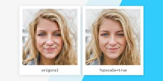 |

---

# 컴퓨터 비전- <span style="font-size: 20px; color: #5f7c8a">주요 목적</span>

###### <span style="color: #5f7c8a">2. 이미지 생성 및 변형</span>

<hr/>

##### 📌 Style Transfer (스타일 변환)

- 한 이미지의 스타일을 다른 이미지에 적용(ex. 사진을 피카소 그림체로 변환)

- 대표 모델: `Neural Style Transfer (NST)`, `AdaIN`

##### 📌 Image Inpainting (이미지 복원)

- 이미지에서 손상된 부분을 자연스럽게 채우기(ex. 낡은 사진 복구, 얼굴 리터칭)

- 대표 모델: `DeepFill` `v2`, `LaMa(llama 아님)`

---

# 컴퓨터 비전- <span style="font-size: 20px; color: #5f7c8a">주요 목적</span>

###### <span style="color: #5f7c8a">2. 이미지 생성 및 변형</span>

<hr/>

<!-- 중앙정렬 -->
<style scoped>
   table{width: 100%}
   td {text-align: center;}
</style>

| Style Transfer                   | Inpainting                        |
| -------------------------------- | --------------------------------- |
| 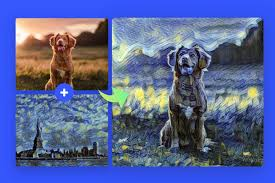 |  |

---

# 컴퓨터 비전- <span style="font-size: 20px; color: #5f7c8a">주요 목적</span>

###### <span style="color: #5f7c8a">3. 3D 비전 및 공간 이해</span>

<hr/>

##### 📌 3D Object Reconstruction (3D 복원)

- 2D 이미지에서 3D 모델을 생성(ex. 얼굴을 3D 아바타로 변환, CT 스캔 분석)

- 대표 모델: `NeRF`, `PointNet`

##### 📌 Depth Estimation (깊이 추정)

- 이미지에서 거리(깊이) 정보 추출(ex. AR 필터, 자율 주행 센서)

- 대표 모델: `MonoDepth`, `DPT`

---

# 컴퓨터 비전- <span style="font-size: 20px; color: #5f7c8a">주요 목적</span>

###### <span style="color: #5f7c8a">3. 3D 비전 및 공간 이해</span>

<hr/>

<!-- 중앙정렬 -->
<style scoped>
   table{width: 100%}
   td {text-align: center;}
</style>

| 3D Object Reconstruction          | Depth Estimation                  |
| --------------------------------- | --------------------------------- |
| 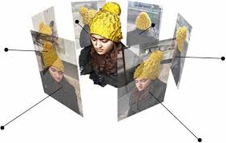 | 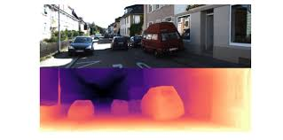 |

---

# 컴퓨터 비전- <span style="font-size: 20px; color: #5f7c8a">주요 목적</span>

###### <span style="color: #5f7c8a">3. 3D 비전 및 공간 이해</span>

<hr/>

##### 📌 Pose Estimation (자세 추정)

- 사람이나 물체의 위치와 자세 추출(ex. 모션 캡처, 스포츠 분석)

- 대표 모델: `OpenPose`, `HRNet`

##### 📌 Optical Flow (광학 흐름 분석)

- 영상에서 픽셀 이동을 추적하여 움직임 분석(ex. 비디오 속도 조정, 동작 감지)

- 대표 모델: `RAFT`, `FlowNet`

---

# 컴퓨터 비전- <span style="font-size: 20px; color: #5f7c8a">주요 목적</span>

###### <span style="color: #5f7c8a">3. 3D 비전 및 공간 이해</span>

<hr/>

<!-- 중앙정렬 -->
<style scoped>
   table{width: 100%}
   td {text-align: center;}
</style>

| Pose Estimation                   | Optical Flow                      |
| --------------------------------- | --------------------------------- |
| 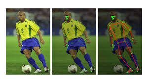 | 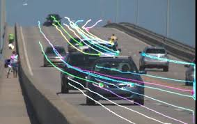 |

---

# 컴퓨터 비전- <span style="font-size: 20px; color: #5f7c8a">주요 목적</span>

###### <span style="color: #5f7c8a">4. 영상 및 실시간 처리</span>

<hr/>

##### 📌 Action Recognition (행동 인식)

- 비디오에서 특정 동작 인식(ex. CCTV에서 싸움 감지, 제스처 인식)

- 대표 모델: `I3D`, `SlowFast`

##### 📌 Video Object Tracking (비디오 객체 추적)

- 영상 내 특정 객체 추적(ex. 드론이 사람을 자동으로 따라감)

- 대표 모델: `SORT`, `DeepSORT`, `Siamese Network`

---

# 컴퓨터 비전- <span style="font-size: 20px; color: #5f7c8a">주요 목적</span>

###### <span style="color: #5f7c8a">4. 영상 및 실시간 처리</span>

<hr/>

##### 📌 Anomaly Detection (이상 탐지)

- 비정상적인 패턴 감지(ex. 불량 감지, 의료 영상 이상 탐지)

- 대표 모델: `Autoencoder`, `GAN-based detection`

---

# 컴퓨터 비전- <span style="font-size: 20px; color: #5f7c8a">주요 목적</span>

###### <span style="color: #5f7c8a">4. 영상 및 실시간 처리</span>

<hr/>

<!-- 중앙정렬 -->
<style scoped>
   table{width: 100%}
   td {text-align: center;}
</style>

| Action Recognition                | Object Tracking                   | Anomaly Detection                 |
| --------------------------------- | --------------------------------- | --------------------------------- |
| 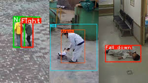 | 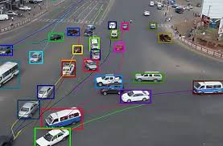 | 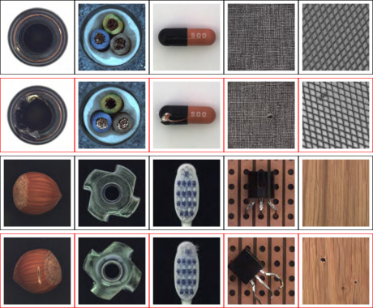 |

---

<style scoped>{text-align: center;}</style>

# Classification 실습

<div style="height:40px"></div>

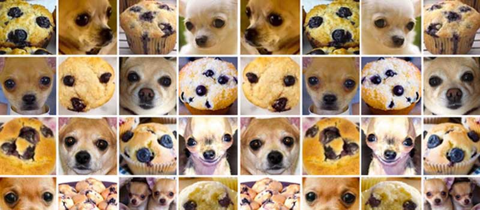

---

# CNN (Convolutional Neural Network) 개요

###### <span style="color: #5f7c8a">구성 요소 / 관련 용어</span>

<hr/>

| 이미지 데이터 처리 중 분류에 특화된 딥러닝 모델.

<br>

###### ✅ 합성곱층 (Convolution Layer)

- 이미지에서 특징(Edges, Shapes)을 추출하는 역할

- 필터(커널)를 이용해 특징 맵을 생성

###### ✅ 활성화 함수 (Activation Function, ReLU)

비선형성을 추가하여 복잡한 패턴 학습 가능

---

# CNN (Convolutional Neural Network) 개요

<hr/>

<!-- 중앙정렬 -->
<style scoped>
   table{width: 100%}
   td {text-align: center;}
</style>

| sigmoid                          | relu                             |
| -------------------------------- | -------------------------------- |
| 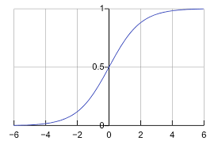 | 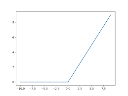 |

---

# CNN (Convolutional Neural Network) 개요

###### <span style="color: #5f7c8a">구성 요소 / 관련 용어</span>

<hr/>

###### ✅ 풀링층 (Pooling Layer)

- 특징 맵의 크기를 줄여 연산량 감소 및 중요한 특징만 유지

- 일반적으로로 Max Pooling 사용

###### ✅ 완전연결층 (Fully Connected Layer, FC)

- 추출된 특징을 바탕으로 최종 분류 수행

###### ✅ Softmax (출력층)

- 각 클래스에 대한 확률값을 출력

---

# mnist dataset이란?

<hr/>

MNIST 데이터셋은 **손글씨 숫자(0-9)** 이미지로 이루어진 데이터셋으로, 60,000개의 훈련 이미지와 10,000개의 테스트 이미지로 구성되었다. 각 이미지는 `28`x`28` 픽셀 크기이다.

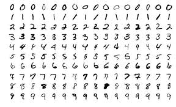

---

# mnist 숫자 분류 실습

<hr/>

```py
import tensorflow as tf
from tensorflow.keras import layers, models
import matplotlib.pyplot as plt
import numpy as np

# 1. MNIST 데이터셋 로드 및 전처리
mnist = tf.keras.datasets.mnist
(x_train, y_train), (x_test, y_test) = mnist.load_data()

# CNN 입력 형태에 맞게 데이터 차원 추가 (28x28 → 28x28x1)
x_train = x_train.reshape(-1, 28, 28, 1).astype('float32') / 255.0
x_test = x_test.reshape(-1, 28, 28, 1).astype('float32') / 255.0
```

---

# mnist 숫자 분류 실습

<hr/>

```py
# 2. CNN 모델 생성
model = models.Sequential([
    layers.Conv2D(32, (3, 3), activation='relu', input_shape=(28, 28, 1)),  # 합성곱층
    layers.MaxPooling2D((2, 2)),  # 풀링층
    layers.Conv2D(64, (3, 3), activation='relu'),
    layers.MaxPooling2D((2, 2)),
    layers.Conv2D(64, (3, 3), activation='relu'),
    layers.Flatten(),  # 1D 벡터로 변환
    layers.Dense(64, activation='relu'),  # 완전연결층
    layers.Dense(10, activation='softmax')  # 출력층 (0~9 숫자 분류)
])
```

---

# mnist 숫자 분류 실습

<hr/>

```py
# 3. 모델 컴파일
model.compile(optimizer='adam',
              loss='sparse_categorical_crossentropy',
              metrics=['accuracy'])

# 4. 모델 학습
history = model.fit(x_train, y_train, epochs=5, validation_data=(x_test, y_test))
```

여기까지만 해도 학습은 OK!

`epoch`: <span style="background:rgb(255, 255, 164)">전체 훈련 데이터셋을 한 번 모두 학습하는 주기(사이클)</span>

---

# mnist 숫자 분류 실습

<hr/>

```py
# 5. 학습 결과 시각화
plt.plot(history.history['accuracy'], label='Train Accuracy')
plt.plot(history.history['val_accuracy'], label='Test Accuracy')
plt.xlabel('Epoch')
plt.ylabel('Accuracy')
plt.legend()
plt.show()

# 6. 모델 평가
test_loss, test_acc = model.evaluate(x_test, y_test)
print(f'\nTest accuracy: {test_acc:.4f}')
```

---

# code 해석

<hr/>

**Convolution(합성곱)** 은 이미지에서 특징(Edges, Textures, Shapes 등)을 추출하는 연산으로 이미지를 작은 영역(커널, 필터)으로 나누어 패턴을 찾음.

<br>

##### ✅ 용어 확인

- <span style="font-weight:bold;background:rgb(255, 255, 164)">입력 이미지</span> `Input Image`: CNN에 입력되는 원본 이미지

- <span style="font-weight:bold;background:rgb(255, 255, 164)">커널 / 필터</span> `Kernel / Filter`: 작은 크기의 행렬. 이미지에서 특징을 추출하는 역할

- <span style="font-weight:bold;background:rgb(255, 255, 164)">스트라이드</span> `Stride`: 필터가 이동하는 간격

- <span style="font-weight:bold;background:rgb(255, 255, 164)">패딩</span> `Padding`: 경계에서 정보 손실을 막기 위해 값 추가(주로 `0`)

---

# code 해석

###### <span style="color: #5f7c8a">Convolution(합성곱) 개념</span>

<hr/>

##### 📌 Convolution 예제

💡 3×3 필터를 사용하여 5×5 이미지에 합성곱 적용

<br>

##### 1️⃣ 원본 이미지 (5×5)

```
 1  2  3  4  5
 6  7  8  9 10
11 12 13 14 15
16 17 18 19 20
21 22 23 24 25
```

---

# code 해석

###### <span style="color: #5f7c8a">Convolution(합성곱) 개념</span>

<hr/>

##### 2️⃣ 3×3 필터 (예: Edge Detection)

```
0  1  0
1 -4  1
0  1  0
```

<br>

##### 3️⃣ 합성곱 연산

필터를 `3×3` 크기로 슬라이딩하면서 원본 이미지와 곱한 다음 합산. 이 과정을 반복하여 feature map 생성

`ex: 7*0 + 8*1 + 9*0 + 12*1 + 13*(-4) + 14*1 + 17*0 + 18*1 + 19*0 = -24`

---

# code 해석

###### <span style="color: #5f7c8a">Convolution(합성곱) 개념</span>

<hr/>

```py
import tensorflow as tf
import numpy as np

# 샘플 이미지 생성 (5x5 이미지)
image = np.array([[1, 2, 3, 4, 5],
                  [6, 7, 8, 9, 10],
                  [11, 12, 13, 14, 15],
                  [16, 17, 18, 19, 20],
                  [21, 22, 23, 24, 25]], dtype=np.float32).reshape(1, 5, 5, 1)

# 3x3 필터 생성
kernel = np.array([[0, 1, 0],
                   [1, -4, 1],
                   [0, 1, 0]], dtype=np.float32).reshape(3, 3, 1, 1)
```

---

# code 해석

###### <span style="color: #5f7c8a">Convolution(합성곱) 개념</span>

<hr/>

```py
# Conv2D 적용
conv_layer = tf.nn.conv2d(image, kernel, strides=[1, 1, 1, 1], padding="VALID")
print(conv_layer.numpy().squeeze())
```

#### 🎶 Result

```
[[0. 0. 0.]
 [0. 0. 0.]
 [0. 0. 0.]]
```

---

# code 해석

###### <span style="color: #5f7c8a">Convolution(합성곱) 개념</span>

<hr/>

**출력 크기 계산**:

`Conv2D` 레이어에서 출력 크기는 필터 크기, 스트라이드, 패딩 값의 영향을 받음

- **입력 크기**: 28×28×1 (높이, 너비, 채널)
- **필터 크기**: 3×3
- **스트라이드**: 기본값은 1×1
- **패딩**: 기본값은 `'valid'`입니다. (패딩 없이 경계에서 잘림)

---

# code 해석

###### <span style="color: #5f7c8a">Convolution(합성곱) 개념</span>

<hr/>

**출력 크기 공식** : `valid`

$$\text{출력 크기} = \left( \frac{W_{\text{in}} - W_{\text{filter}}}{S} \right) + 1$$

여기서,

$W\_{\text{in}}$: 입력 이미지 크기 (28)

$W\_{\text{filter}}$: 필터 크기 (3)

$S$: 스트라이드 (1)

---

# code 해석

###### <span style="color: #5f7c8a">Convolution(합성곱) 개념</span>

<hr/>

`layers.Conv2D(32, (3, 3), activation='relu', input_shape=(28, 28, 1))` 해석

$$
\text{출력 크기} = \left( \frac{28 - 3}{1} \right) + 1 = 26
$$

출력 크기는 **26×26**.

**출력 채널 수**:

`Conv2D(32, ...)`에서 **32**는 필터의 개수. 즉, **32개의 특성 맵**이 생성.

---

# code 해석

###### <span style="color: #5f7c8a">Convolution(합성곱) 개념</span>

<hr/>

**결과**:

따라서, `Conv2D(32, (3, 3), activation='relu', input_shape=(28, 28, 1))`을 적용한 후의 출력 크기

- **26×26** 크기의 이미지 (높이, 너비)
- **32개의 채널** (출력 필터 개수)

**출력 텐서**: <span style="background:rgb(255, 255, 164)">(26, 26, 32)</span>

---

# code 해석

###### <span style="color: #5f7c8a">Convolution(합성곱) 개념</span>

<hr/>

##### padding의 종류

- `VALID`: 패딩을 추가하지 않음. 출력 크기는 입력보다 작아짐.

- `SAME`: 출력 크기가 입력 크기와 동일하도록 패딩을 추가함. 일반적으로 패딩에 사용되는 값은 `0`

---

# code 해석

###### <span style="color: #5f7c8a">MaxPooling2D</span>

<hr/>

MaxPooling2D는 2D 이미지에서 각 영역(필터 크기)에 대해 최댓값을 추출하여 출력 이미지로 전달하는 연산.

<br>

##### 🏷️ 매개변수:

`pool_size`: 풀링을 수행할 윈도우(필터) 크기. 예를 들어, (2, 2)이면 2x2 영역에서 최댓값 추출.

`strides`: 풀링 필터가 이동하는 간격. 기본값은 (2, 2). 이 경우 풀링 필터가 한 번에 2칸씩 이동하면서 연산.

`padding`: 풀링의 경계 처리 방법 설정. 기본값은 valid로.

---

# code 해석

###### <span style="color: #5f7c8a">Sequential 진행에 따른 텐서 변화</span>

<hr/>

1. **Conv2D1**: `26` × `26` × `32`

2. **MaxPooling1**: `13` × `13` × `32`

3. **Conv2D2**: `11` × `11` × `64`

4. **MaxPooling2**: `5` × `5` × `64`

5. **Conv2D3**: `3` × `3` × `64`

6. **Flatten**: `576` (1D 벡터화)

7. **Dense1**: <- 경험적으로 설정 `64`

8. **Dense2**: <- 0부터 9까지 `10`개(최종 판단 기준)

---

# 결과 예측

<hr/>

```py
import numpy as np
import matplotlib.pyplot as plt

# 7. MNIST 데이터셋에서 랜덤 이미지 하나 선택
random_idx = np.random.randint(0, len(x_test))  # x_test에서 랜덤 인덱스 선택
random_image = x_test[random_idx]  # 랜덤 이미지
true_label = y_test[random_idx]  # 실제 레이블

# 8. 모델로 예측
predicted_label = model.predict(np.expand_dims(random_image, axis=0))  # 예측
predicted_class = np.argmax(predicted_label)  # 예측된 클래스 (0~9)
```

---

# 결과 예측

<hr/>

```py
# 9. 이미지 출력
plt.imshow(random_image.squeeze(), cmap='gray')  # 이미지를 그레이스케일로 출력
plt.title(f"True Label: {true_label}, Predicted: {predicted_class}")  # 실제 레이블과 예측된 레이블 출력
plt.show()

# 10. 예측 결과 출력
print(f"True Label: {true_label}")
print(f"Predicted Label: {predicted_class}")
```

---

# AI 성능 평가 지표

<hr/>

##### 🏷️ 조건부 확률

조건부 확률은 어떤 사건 A가 발생했을 때, 다른 사건 B가 발생할 확률로 다음과 같이 표시한다.

$$ P(B | A) = P(A ∩ B) / P(A) $$

| 전체 사건 중에서 A가 일어난 경우만 고려하여 B의 확률을 계산

---

# AI 성능 평가 지표

<hr/>

AI 모델의 성능을 평가하는 주요 지표인 Accuracy, Precision, Recall, F1-score 계산을 위해 다음 내용의 이해가 필요하다.

| 실제\예측        | Positive (1)        | Negative (0)        |
| ---------------- | ------------------- | ------------------- |
| **Positive (1)** | True Positive (TP)  | False Negative (FN) |
| **Negative (0)** | False Positive (FP) | True Negative (TN)  |

##### 각 요소의 의미

- **TP (True Positive)**: 실제로 Positive인 데이터를 Positive로 예측한 경우
- **TN (True Negative)**: 실제로 Negative인 데이터를 Negative로 예측한 경우
- **FP (False Positive)**: 실제로 Negative인데 Positive로 예측한 경우
- **FN (False Negative)**: 실제로 Positive인데 Negative로 예측한 경우

---

# AI 성능 평가 지표

<hr/>

#### ✅ Accuracy (정확도)

모델이 올바르게 예측한 비율

$$\text{Accuracy} = \frac{TP + TN}{TP + TN + FP + FN}$$

- 무작위로 선택한 데이터가 정확히 분류될 조건부 확률
- $P(\text{예측이 정답} \mid \text{모든 샘플})$

---

# AI 성능 평가 지표

<hr/>

#### ✅ Precision (정밀도, 양성 예측도)

Positive로 예측한 것들 중에서 실제로 Positive인 비율

$$\text{Precision} = \frac{TP}{TP + FP}$$

- $P(\text{실제 Positive} \mid \text{모델이 Positive라고 예측함})$
- 예측이 Positive일 때, 실제 Positive일 확률 (FP를 줄이는 것이 중요)

---

# AI 성능 평가 지표

<hr/>

#### ✅ Recall (재현율, 민감도, TPR - True Positive Rate)

실제 Positive 중에서 올바르게 예측한 비율

$$\text{Recall} = \frac{TP}{TP + FN}$$

- $P(\text{모델이 Positive라고 예측함} \mid \text{실제 Positive})$
- 실제 Positive일 때, 이를 올바르게 감지할 확률 (FN을 줄이는 것이 중요)

---

# AI 성능 평가 지표

<hr/>

#### ✅ F1-score (조화 평균, 균형 측정값)

Precision과 Recall의 조화 평균으로, Precision과 Recall의 균형을 평가

$$\text{F1-score} = \frac{2 \times \text{Precision} \times \text{Recall}}{\text{Precision} + \text{Recall}}$$

- Precision과 Recall 사이의 균형을 유지하면서 최적의 성능을 찾기 위한 지표
- Precision과 Recall이 극단적으로 차이가 나는 경우를 방지

---

# AI 성능 평가 지표

<hr/>

어떤 의사가 진단을 내리려고 한다. 사진 `100`장이 있을 때, 암 위험 분류 사진은 `6`장이고 나머지 `94`장은 정상이다.

의사는 이 중 `90`장을 암 위험으로 분류했다. 그리고 그 안에 실제 암 위험 분류 사진 `6`장이 전부 포함되었다.

<style scoped>table{font-size:26px}</style>

| 실제 \ 예측                 | 암 위험(Positive) | 정상(Negative) |
| --------------------------- | ----------------- | -------------- |
| **암 위험 (Positive, 6장)** | **TP = 6**        | **FN = 0**     |
| **정상 (Negative, 94장)**   | **FP = 84**       | **TN = 10**    |

---

# AI 성능 평가 지표

<hr/>

##### 결과

<style scoped>table{font-size:32px}</style>

| 지표          | 계산식                                                        | 값        |
| ------------- | ------------------------------------------------------------- | --------- |
| **Accuracy**  | $\frac{TP + TN}{TP + TN + FP + FN}$                           | **16%**   |
| **Precision** | $\frac{TP}{TP + FP}$                                          | **6.7%**  |
| **Recall**    | $\frac{TP}{TP + FN}$                                          | **100%**  |
| **F1-score**  | $\frac{2 \times Precision \times Recall}{Precision + Recall}$ | **12.6%** |

---

# 추가로 해보면 좋은거

<hr/>

##### cifar-100 dataset

<div style="height:20px"></div>

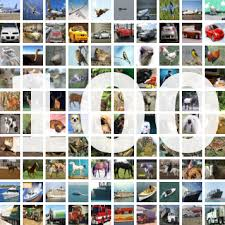
